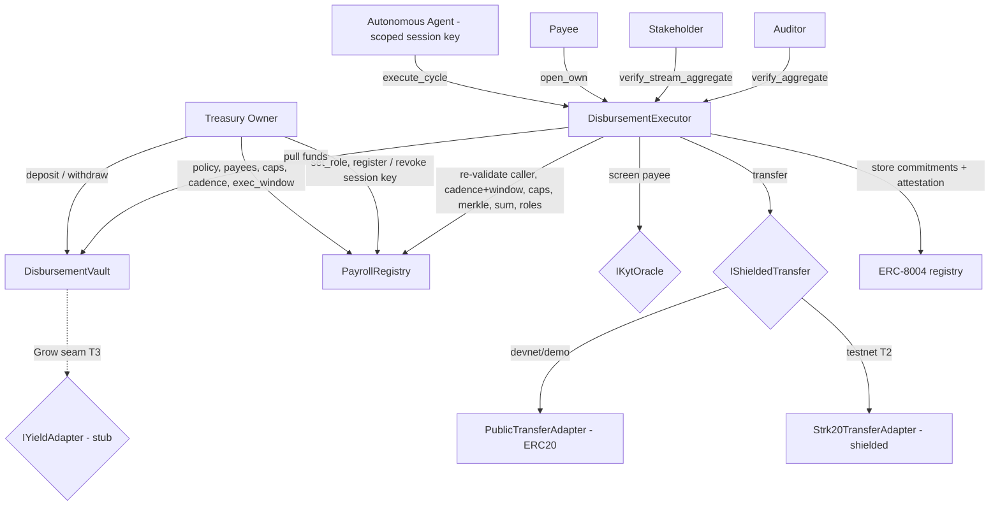

# Chaum

**The confidential operating account for onchain organizations.** A treasury funds a vault, defines a role registry and a policy, and delegates **one scoped session key** to an autonomous agent that runs disbursement cycles across **streams** (payroll / vendor / grant). The agent *proposes*; the contract *disposes* — every condition is re-validated on-chain before any token moves.

Three modules, in strict sequence: **Disburse** (the wedge) → **Prove** (the moat) → **Grow** (the T3 engine, present today as a seam).

> **Individual amounts are private. The aggregate — and each category — is provable, to exactly the right party.**

Named for David Chaum — blind signatures and digital cash.

Built for the STRK20 Request for Startups #11.

---

## Live deployment

| | |
| --- | --- |
| **Console** (functional, live Sepolia data) | **https://beta.chaum.fun** · [chaum-app.vercel.app](https://chaum-app.vercel.app) |
| **Landing** (selective-disclosure demo) | [chaum-landing.vercel.app](https://chaum-landing.vercel.app) |
| **Repo** | [github.com/kunaldrall29/Chaum](https://github.com/kunaldrall29/Chaum) |

### Contracts on Starknet Sepolia (operating-account build — live)

The full operating-account build — **streams, roles, role-scoped disclosure, execution-window jitter, and the KYT gate** — is deployed and running on **Starknet Sepolia**, seeded with 12 users across payroll/vendor/grant and two real verified cycles.

| Contract | Address (Voyager) |
| --- | --- |
| `MockERC20` — Chaum USD (`cUSD`) | [`0xdfe246…92556c`](https://sepolia.voyager.online/contract/0xdfe2463b1350496e9615dd777226e699535d2850cb8af2d5c63b13e092556c) |
| `PayrollRegistry` (policy + roles) | [`0x612669…c9f212`](https://sepolia.voyager.online/contract/0x6126696449e1d97009b02cc0e8bb9f354def6bc21bc389bf91ee0de7bc9f212) |
| `DisbursementVault` | [`0x188299…e10849a`](https://sepolia.voyager.online/contract/0x1882996f9033b26e39533255fac09ebada3a436460cff470d0347472e10849a) |
| `PublicTransferAdapter` | [`0x7e027a…df7b6e4`](https://sepolia.voyager.online/contract/0x7e027a60d854183381dd1013d8d9fb4bf78408d0139f970ddbbd4e55df7b6e4) |
| `DisbursementExecutor` (streams + KYT) | [`0x7712ac…3e4aa49`](https://sepolia.voyager.online/contract/0x7712ac81ab58d76e89431ec6938db95c4dcd7b1b4f2792614b799c063e4aa49) |
| `MockKytOracle` | [`0x544421…384d89d1`](https://sepolia.voyager.online/contract/0x544421e64a22a2ad4bb68d2f8bb29bc58992e58028b26372266242d384d89d1) |

Owner / agent account: [`0x020cc0…0de4f2`](https://sepolia.voyager.online/contract/0x020cc09b5ceff6ccb001071bbc1507a8224892e4bde893501de0e69fe10de4f2). Roles set for an auditor, a stakeholder, and a payee; `node-ops.stark` is KYT-denied (skip-and-logged, not paid).

Two real multi-stream cycles, both `verify_aggregate = true`:
- Cycle 1: [tx `0x5bb46e…f90c7d`](https://sepolia.voyager.online/tx/0x5bb46ee32a6651611b3e2e74125ee839db55d6fbb1129c703101ebc52f90c7d) — 11 paid (1 KYT-denied): payroll 17,110 · vendor 8,200 · grant 13,000.
- Cycle 2: [tx `0x29b624…13822ea`](https://sepolia.voyager.online/tx/0x29b62418d811680962885c7c1746b45b770e330834a1625e4a600b1b13822ea).

Policy: per-payee cap 1,000,000 · per-cycle cap 10,000,000 · cadence 60s · exec_window 50s. Full record in [docs/DEPLOYMENTS.md](docs/DEPLOYMENTS.md).

> The live [console](https://chaum-app.vercel.app) still renders the payroll-era build; the operating-account console (streams + role-scoped **Prove** center, reading these addresses) is the next step. The prior payroll-era contracts are retired — see [docs/DEPLOYMENTS.md](docs/DEPLOYMENTS.md).

---

## Why

Organizations that run treasury operations on-chain face a dilemma: automate disbursement and either (a) hand an agent a hot wallet that can drain everything, or (b) leak every salary, vendor invoice, and grant to the entire world, forever. Chaum refuses both.

- **Bounded delegation (Disburse).** The agent holds a session key scoped to exactly one action — `execute_cycle` — against a fixed payee set, under per-payee and per-cycle caps, a minimum cadence, and an execution window it must land inside. Every payout is classified into a stream (payroll / vendor / grant) and screened by a KYT gate before it settles. A compromised agent key **cannot** withdraw, redirect funds, pay a non-payee, or exceed caps. The contract re-checks every rule on every call.
- **Role-scoped selective disclosure (Prove).** Per-payee amounts are hidden behind additively-homomorphic Pedersen commitments. The protocol proves `Σ amounts = disbursed total` without revealing the split — and proves each *category* subtotal independently. Disclosure is role-gated by the on-chain registry: an **auditor** verifies only the aggregate, a **stakeholder** verifies only a stream's subtotal, a **payee** opens only their own line — and each scope is isolation-tested against the others.

## What's private vs. provable

| Fact | Who can learn it | How |
| --- | --- | --- |
| The set of approved payees + their stream | Public (as a Merkle root) | root over `(payee, stream)` leaves in `PayrollRegistry` |
| Per-payee, per-cycle, cadence caps, exec window | Public | Policy in `PayrollRegistry` |
| The cycle's **aggregate** total | Auditor role | `verify_aggregate(cycle_id)` over the homomorphic commitment sum |
| A **stream's** subtotal (payroll / vendor / grant) | Stakeholder role | `verify_stream_aggregate(cycle_id, stream)` over the per-stream commitment |
| An **individual** payee's amount | That payee only | `open_own(cycle_id, payee, amount, blinding)` — reverts for anyone else |
| The split of the total across payees | **No one** (commitment layer) | Pedersen commitments are perfectly hiding |
| The amount actually transferred | Depends on the transfer adapter — see below | — |

### Honest caveat on the transfer leg

Starknet calldata and ERC-20 `Transfer` events are public and permanent. Chaum's **commitment ledger, aggregate proof, and selective disclosure are real and fully functional today.** But amount confidentiality of the *token movement itself* is only as strong as the active transfer adapter:

- **`PublicTransferAdapter`** (devnet/demo): a plain ERC-20 transfer. The amount leaks in the ERC-20 event. Privacy is **demonstrated via commitments, not yet enforced end-to-end.**
- **`Strk20TransferAdapter`** (testnet/mainnet, T2): routes the movement through [STRK20](https://www.starknet.io/blog/starknet-v0-14-2-the-privacy-engine-arrives/) shielded transfers. The amount is hidden at the token layer. Because the commitment layer is already in place, this activates with **zero change** to Chaum's cryptographic core. STRK20 launched in March 2026; its developer SDK is a subsequent phase, so the real adapter is interface-complete and wired once the SDK lands.

Chaum's *own* events never carry cleartext amounts — only commitment coordinates. The only amount leak is isolated inside the one swappable adapter.

## What the agent **cannot** do

A compromised or malicious agent session key can **only** do exactly one thing: call `execute_cycle` to pay the **already-registered** payee set, from the **already-funded** vault, **within caps**, **no more often than the cadence**, **inside the execution window**. Specifically it **cannot**:

- Withdraw funds to itself or any non-payee address — there is no fund path out of the vault except to a Merkle-proven payee or back to the owner.
- Add, remove, or change payees, assign a role, raise any cap, or change the window — those are owner-only and the agent key is rejected.
- Pay any address not in the committed `(payee, stream)` Merkle set — membership is proven on-chain per payout.
- Exceed `max_per_payee` or `max_per_cycle`, run a cycle before the cadence elapses, or land outside the execution window.
- Bypass the KYT screen — a denied payee is skipped-and-logged (or the cycle reverts, per policy).
- Call any entrypoint other than `execute_cycle`, or grant itself any disclosure scope beyond its role.
- Act after the owner calls `revoke` (which zeroes the session key) or `pause`.

The owner can revoke at any time. The agent never holds custody.

## Architecture



## Repository layout

```
contracts/   Cairo (Scarb): registry (policy+roles), vault, executor (streams+KYT), commitments, merkle, interfaces/, adapters/ (public, strk20 stub, mock KYT, yield stub), mocks, vendor/
agent/        TypeScript agent runtime: deterministic engine, streams, jitter, anomaly-halt, audit packets — no LLM in the hot path
scripts/      deploy, run-cycle, deploy-and-seed (12 users across streams)
dashboard/    Vite + React console reading LIVE Sepolia data via starknet.js
landing/      marketing + selective-disclosure demo (static, design-system)
docs/         ARCHITECTURE, COMPLIANCE_MODEL, POLICY_MODEL, PRIVACY_THREAT_MODEL, GROW_DESIGN, DECISIONS, GRANT_MILESTONES, DEPLOYMENTS
```

## Quickstart

> Requires the Starknet toolchain via [starkup](https://sh.starkup.sh) (Scarb, Starknet Foundry, devnet) and Node 20+ with pnpm.

```bash
# 1. Install the Cairo toolchain
curl --proto '=https' --tlsv1.2 -sSf https://sh.starkup.sh | sh

# 2. Build & test the contracts
cd contracts && scarb build && snforge test

# 3. Install JS deps and run the end-to-end demo (boots devnet, deploys, runs a private cycle)
cd .. && pnpm install && pnpm demo
```

The demo proves, in one command: individual amounts hidden (commitments only), aggregate verified, one payee opens their own amount, an auditor verifies the sum, a non-payee is rejected, and an over-cap payout reverts. (Validated end-to-end on starknet-devnet — `✅ DEMO PASSED`.)

View the UIs:

```bash
pnpm landing                          # marketing + disclosure demo → http://localhost:8000
cd dashboard && npm install && npm run dev   # live console (5 pages)      → http://localhost:5173
```

The console reads the deployed Sepolia contracts directly — vault balance, policy/caps/cadence, per-payee commitments, `verify_aggregate`, and `CycleExecuted` events are all live; the Disclosure → Payee view recomputes `commit(amount, blinding)` in the browser and checks it against the on-chain commitment.

## Documentation

- [docs/ARCHITECTURE.md](docs/ARCHITECTURE.md) — components and data flow
- [docs/COMPLIANCE_MODEL.md](docs/COMPLIANCE_MODEL.md) — the commitment scheme, role-scoped disclosure guarantees, KYT screening, exactly what each party learns
- [docs/POLICY_MODEL.md](docs/POLICY_MODEL.md) — the policy object (streams, roles, window, anomaly) and its enforcement
- [docs/PRIVACY_THREAT_MODEL.md](docs/PRIVACY_THREAT_MODEL.md) — the honest scope: what's private, what leaks, per adapter
- [docs/GROW_DESIGN.md](docs/GROW_DESIGN.md) — the `IYieldAdapter` seam and the T3 Grow module
- [docs/DECISIONS.md](docs/DECISIONS.md) — key technical decisions and tradeoffs
- [docs/GRANT_MILESTONES.md](docs/GRANT_MILESTONES.md) — Disburse / Prove / Grow across T1 / T2 / T3
- [docs/DEPLOYMENTS.md](docs/DEPLOYMENTS.md) — toolchain versions and deployed addresses

## Status

Proof of concept (T1: Disburse + Prove). The operating-account build (streams, roles, role-scoped disclosure, execution window, KYT gate, Grow/bridge seams) is **deployed and live on Starknet Sepolia** — 12 users across payroll/vendor/grant, a KYT-denied payee, and two real cycles both `verify_aggregate = true` (addresses above). **61 `snforge` tests green** (revert matrix + role-scope isolation + stream subtotals), **16 agent tests** (jitter / anomaly / packets), `pnpm demo` passes end-to-end on devnet, and commitment math is cross-verified Cairo ↔ TypeScript. Next: point the console at the live operating-account addresses (streams + role-scoped Prove center).

Strict non-goals for V1: live yield, bridge implementation, Lyapunov, cards, consumer/mass-market payroll, multi-chain runtime, token, mainnet, LLM in the execution path, recipient-side accounts.

## License

MIT — see [LICENSE](LICENSE).
