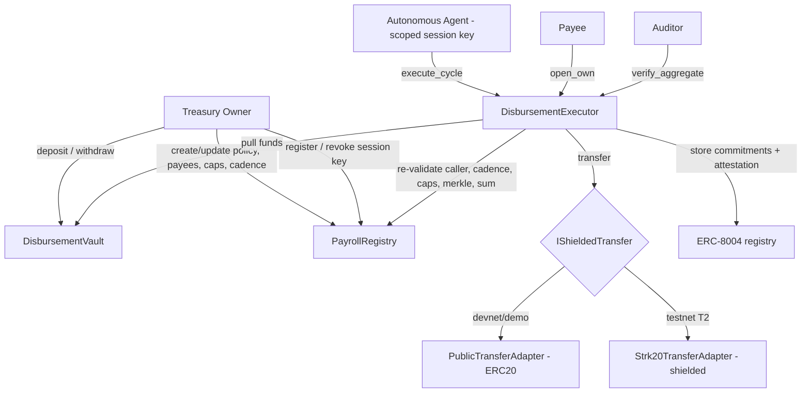

# Chaum

**Private payroll & treasury disbursement on Starknet.** A treasury funds a vault, defines a payee set and a policy, and delegates **one scoped session key** to an autonomous agent that runs disbursement cycles. The agent *proposes*; the contract *disposes* — every condition is re-validated on-chain before any token moves.

> **Individual amounts are private. The aggregate is provable.**

Named for David Chaum — blind signatures and digital cash.

Built for the STRK20 Request for Startups #11.

---

## Why

Treasuries that run payroll on-chain face a dilemma: automate disbursement and either (a) hand an agent a hot wallet that can drain everything, or (b) leak every employee's salary to the entire world, forever. Chaum refuses both.

- **Bounded delegation.** The agent holds a session key scoped to exactly one action — `execute_cycle` — against a fixed payee set, under per-payee and per-cycle caps and a minimum cadence. A compromised agent key **cannot** withdraw, redirect funds, pay a non-payee, or exceed caps. The contract re-checks every rule on every call.
- **Selective privacy.** Per-payee amounts are hidden behind additively-homomorphic Pedersen commitments. The protocol proves `Σ amounts = disbursed total` without revealing the split. Each payee can open *only their own* commitment; an auditor can verify *only the aggregate*.

## What's private vs. provable

| Fact | Who can learn it | How |
| --- | --- | --- |
| The set of approved payees | Public | Merkle root in `PayrollRegistry` |
| Per-payee, per-cycle, cadence caps | Public | Policy in `PayrollRegistry` |
| The cycle's **aggregate** total | Anyone / auditor | `verify_aggregate(cycle_id)` over the homomorphic commitment sum |
| An **individual** payee's amount | That payee only | `open_own(cycle_id, payee, amount, blinding)` — reverts for anyone else |
| The split of the total across payees | **No one** (commitment layer) | Pedersen commitments are perfectly hiding |
| The amount actually transferred | Depends on the transfer adapter — see below | — |

### Honest caveat on the transfer leg

Starknet calldata and ERC-20 `Transfer` events are public and permanent. Chaum's **commitment ledger, aggregate proof, and selective disclosure are real and fully functional today.** But amount confidentiality of the *token movement itself* is only as strong as the active transfer adapter:

- **`PublicTransferAdapter`** (devnet/demo): a plain ERC-20 transfer. The amount leaks in the ERC-20 event. Privacy is **demonstrated via commitments, not yet enforced end-to-end.**
- **`Strk20TransferAdapter`** (testnet/mainnet, T2): routes the movement through [STRK20](https://www.starknet.io/blog/starknet-v0-14-2-the-privacy-engine-arrives/) shielded transfers. The amount is hidden at the token layer. Because the commitment layer is already in place, this activates with **zero change** to Chaum's cryptographic core. STRK20 launched in March 2026; its developer SDK is a subsequent phase, so the real adapter is interface-complete and wired once the SDK lands.

Chaum's *own* events never carry cleartext amounts — only commitment coordinates. The only amount leak is isolated inside the one swappable adapter.

## What the agent **cannot** do

A compromised or malicious agent session key can **only** do exactly one thing: call `execute_cycle` to pay the **already-registered** payee set, from the **already-funded** vault, **within caps**, **no more often than the cadence**. Specifically it **cannot**:

- Withdraw funds to itself or any non-payee address — there is no fund path out of the vault except to a Merkle-proven payee or back to the owner.
- Add, remove, or change payees, or raise any cap — those are owner-only and the agent key is rejected.
- Pay any address not in the committed Merkle payee set — membership is proven on-chain per payout.
- Exceed `max_per_payee` or `max_per_cycle`, or run a cycle before the cadence elapses.
- Call any entrypoint other than `execute_cycle`.
- Act after the owner calls `revoke` (which zeroes the session key) or `pause`.

The owner can revoke at any time. The agent never holds custody.

## Architecture



## Repository layout

```
contracts/   Cairo (Scarb workspace): registry, vault, executor, commitments, adapters, mocks
agent/        TypeScript agent runtime: deterministic cycle engine, no LLM in the hot path
dashboard/    Vite + React: Treasury, Policy, Cycle, Disclosure, Activity
scripts/      deploy, seed-demo, run-cycle (pnpm demo)
docs/         ARCHITECTURE, COMPLIANCE_MODEL, POLICY_MODEL, DECISIONS, GRANT_MILESTONES, DEPLOYMENTS
```

## Quickstart

> Requires the Starknet toolchain via [starkup](https://sh.starkup.sh) (Scarb, Starknet Foundry, devnet) and Node 20+ with pnpm.

```bash
# 1. Install the Cairo toolchain
curl --proto '=https' --tlsv1.2 -sSf https://sh.starkup.sh | sh

# 2. Build & test the contracts
cd contracts && scarb build && snforge test

# 3. Install JS deps and run the end-to-end demo (boots devnet, deploys, runs a private cycle)
cd .. && pnpm install && pnpm demo
```

The demo proves, in one command: individual amounts hidden (commitments only), aggregate verified, one payee opens their own amount, an auditor verifies the sum, a non-payee is rejected, and an over-cap payout reverts.

## Documentation

- [docs/ARCHITECTURE.md](docs/ARCHITECTURE.md) — components and data flow
- [docs/COMPLIANCE_MODEL.md](docs/COMPLIANCE_MODEL.md) — the commitment scheme, disclosure guarantees, exactly what each party learns
- [docs/POLICY_MODEL.md](docs/POLICY_MODEL.md) — the policy object and its enforcement
- [docs/DECISIONS.md](docs/DECISIONS.md) — key technical decisions and tradeoffs
- [docs/GRANT_MILESTONES.md](docs/GRANT_MILESTONES.md) — T1 / T2 / T3 roadmap
- [docs/DEPLOYMENTS.md](docs/DEPLOYMENTS.md) — toolchain versions and deployed addresses

## Status

Proof of concept (T1). Strict non-goals for V1: yield, lending, cards, consumer/mass-market payroll, multi-chain, token, mainnet, LLM in the execution path, recipient-side accounts.

## License

MIT — see [LICENSE](LICENSE).
