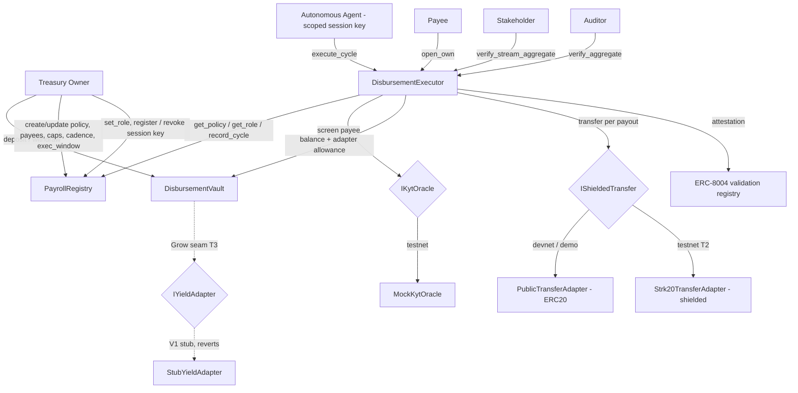

# Architecture

Chaum is the **confidential operating account for onchain organizations** —
three on-chain contracts, one off-chain agent, a console, and a landing page,
across three modules: **Disburse** (the wedge), **Prove** (the moat), **Grow**
(the T3 engine, present as a seam). The principle throughout: **the agent
proposes, the contract disposes** — every condition is re-validated on-chain
before any token moves.

## Components



### On-chain (`contracts/`, Cairo / Scarb)

| Contract | Responsibility |
| --- | --- |
| [`PayrollRegistry`](../contracts/src/payroll_registry.cairo) | The policy + **roles**: payee Merkle root over `(payee, stream)`, caps, cadence, **exec_window**, anomaly thresholds, pause, registered agent; `set_role`/`get_role`. Owner-only mutators (OZ `Ownable`); executor-only `record_cycle`. |
| [`DisbursementVault`](../contracts/src/disbursement_vault.cairo) | ERC-20 custody. Owner `deposit`/`withdraw`; `set_spender` approves the adapter. Reentrancy-guarded. No fund path out except to the owner or via the executor-gated adapter allowance. |
| [`DisbursementExecutor`](../contracts/src/disbursement_executor.cairo) | The single agent entrypoint `execute_cycle`. Re-validates the whole policy (streams, caps, cadence+window, Merkle, KYT), stores per-payout **and per-stream** commitments, transfers via the adapter, attests. Serves role-scoped `verify_aggregate` / `verify_stream_aggregate` / `open_own`. |
| [`commitments`](../contracts/src/commitments.cairo) + [`generators`](../contracts/src/generators.cairo) | Additively-homomorphic EC Pedersen commitments `C = amount·G + blinding·H`. |
| [`merkle`](../contracts/src/merkle.cairo) | Payee-set membership over `(payee, stream)` leaves (commutative Poseidon). |
| [`adapters/`](../contracts/src/adapters/) | `IShieldedTransfer` (public ERC-20 now + STRK20 stub T2), `MockKytOracle`, `StubYieldAdapter`. |
| [`interfaces/`](../contracts/src/interfaces/) | `IShieldedTransfer`, `IKytOracle`, `IYieldAdapter`, `IBridgeIn` — the swappable seams. |
| [`vendor/`](../contracts/vendor/) | ERC-8004 + session/agent account, vendored from starknet-agentic. |

### Off-chain (`agent/`, TypeScript)

Deterministic cycle engine — no LLM in the hot path. Modules:
`commitments` / `merkle` / `streams` (cross-verified twins of the Cairo code),
`engine` (decide + build a multi-stream cycle plan), `jitter` (windowed random
execution time), `anomaly` (both-threshold halt), `packets` (audit-packet zip),
`chain` (starknet.js client), `runner` (simulate → submit → confirm, idempotent +
retries), `scheduler` (poll loop), `state` (sqlite), plus optional `explain`
(post-hoc Claude summary) and `notify` (webhook/Telegram).

### Interfaces (`app/`, `landing/`)

Console (Vite + React + `@starknet-io/get-starknet`, live RPC reads): Treasury /
Policy / Cycle (per-stream redaction bars) / **Prove** (role-scoped disclosure
center — auditor aggregate, stakeholder category, payee open) / Activity. Landing
page: the marketing + selective-disclosure demo (vendored from Claude Design).

## The cycle, end to end

```mermaid
sequenceDiagram
    participant Ag as Agent (off-chain)
    participant Ex as DisbursementExecutor
    participant Re as PayrollRegistry
    participant Ky as KytOracle
    participant Va as DisbursementVault
    participant Ad as Adapter
    Ag->>Ag: build multi-stream payouts, fresh blindings, commitments, (payee,stream) proofs
    Ag->>Ag: anomaly check (payee-set × total); jitter → pick time in exec_window
    Ag->>Ex: simulate execute_cycle (fee estimation)
    Ag->>Ex: execute_cycle(cycle_id, payouts[])  (session key)
    Ex->>Re: get_policy()
    Ex->>Ex: assert !paused, !revoked, caller ok, cadence + within exec_window
    loop each payout
        Ex->>Ex: Merkle membership on (payee,stream), amount<=cap, recompute commitment, blinding!=0
        Ex->>Ky: screen(payee) → skip-and-log or revert per policy
        Ex->>Ex: accumulate grand total + per-stream subtotal
    end
    Ex->>Ex: total<=cycle cap; C_total == commit(Σamount, Σblinding); stream subtotals consistent
    Ex->>Va: balance() >= total
    loop each payout
        Ex->>Ad: transfer(payee, amount, note)
        Ad->>Va: transfer_from(vault, payee, amount)
    end
    Ex->>Re: record_cycle(now)
    Ex->>Ex: emit CycleExecuted (commitments only, no amounts)
```

## Data flow & privacy

- The agent holds the private payroll (payees + amounts) and generates a fresh
  blinding per payout. It commits client-side, then submits.
- The executor recomputes each commitment from the supplied `(amount, blinding)`
  and checks `Σ Cᵢ == commit(Σamount, Σblinding)` — binding the stored ledger to
  the disbursed total without an amount ever entering Chaum's events.
- Disclosure is **role-scoped** (read from the registry): `verify_aggregate`
  (auditor) proves the cycle total; `verify_stream_aggregate` (stakeholder)
  proves a single category's subtotal; `open_own` (payee) proves one line item —
  and each scope is isolation-tested against the others. See
  [COMPLIANCE_MODEL.md](COMPLIANCE_MODEL.md).
- The amount leak in V1 is isolated to the `PublicTransferAdapter`'s ERC-20
  event; swapping in the STRK20 adapter (T2) closes it with no other change.
  See [PRIVACY_THREAT_MODEL.md](PRIVACY_THREAT_MODEL.md) for the honest scope.

## Trust boundaries

- **Agent key:** scoped to `execute_cycle` only; bounded entirely by the policy;
  revocable. See the "what the agent cannot do" section of the [README](../README.md).
- **Vault:** funds leave only to a Merkle-proven payee (executor-gated adapter)
  or back to the owner.
- **Owner:** the sole mutator of policy, payees, caps, and the agent registration.

See [DECISIONS.md](DECISIONS.md) for why each piece is built the way it is.
