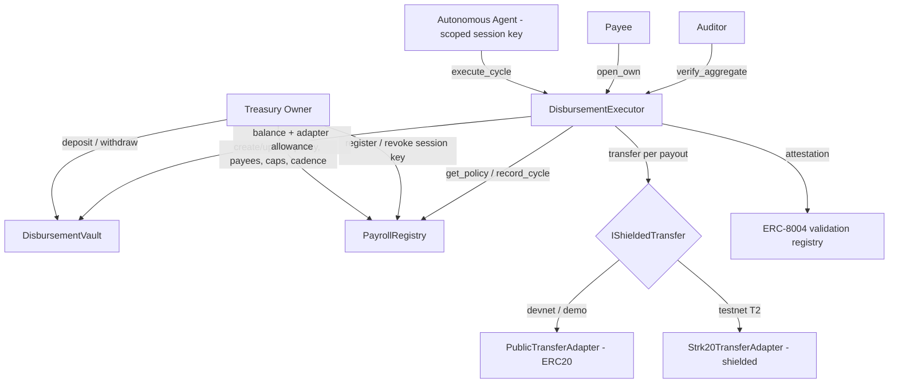

# Architecture

Chaum has three on-chain contracts, one off-chain agent, a dashboard, and a
landing page. The principle throughout: **the agent proposes, the contract
disposes** — every condition is re-validated on-chain before any token moves.

## Components



### On-chain (`contracts/`, Cairo / Scarb)

| Contract | Responsibility |
| --- | --- |
| [`PayrollRegistry`](../contracts/src/payroll_registry.cairo) | The policy: payee Merkle root, per-payee/per-cycle caps, cadence, pause, registered agent. Owner-only mutators (OZ `Ownable`); executor-only `record_cycle`. |
| [`DisbursementVault`](../contracts/src/disbursement_vault.cairo) | ERC-20 custody. Owner `deposit`/`withdraw`; `set_spender` approves the adapter. Reentrancy-guarded. No fund path out except to the owner or via the executor-gated adapter allowance. |
| [`DisbursementExecutor`](../contracts/src/disbursement_executor.cairo) | The single agent entrypoint `execute_cycle`. Re-validates the whole policy, stores commitments, transfers via the adapter, attests. Serves `verify_aggregate` / `open_own`. |
| [`commitments`](../contracts/src/commitments.cairo) + [`generators`](../contracts/src/generators.cairo) | Additively-homomorphic EC Pedersen commitments `C = amount·G + blinding·H`. |
| [`merkle`](../contracts/src/merkle.cairo) | Payee-set membership (commutative Poseidon). |
| [`adapters/`](../contracts/src/adapters/) | `IShieldedTransfer` impls: public ERC-20 (now) + STRK20 shielded stub (T2). |
| [`vendor/`](../contracts/vendor/) | ERC-8004 + session/agent account, vendored from starknet-agentic. |

### Off-chain (`agent/`, TypeScript)

Deterministic cycle engine — no LLM in the hot path. Modules:
`commitments` / `merkle` (cross-verified twins of the Cairo code), `engine`
(decide + build a cycle plan), `chain` (starknet.js client), `runner`
(simulate → submit → confirm, with idempotency + retries), `scheduler` (poll
loop), `state` (sqlite), plus optional `explain` (post-hoc Claude summary) and
`notify` (webhook/Telegram).

### Interfaces (`dashboard/`, `landing/`)

Dashboard (Vite + React + starknetkit): Treasury / Policy / Cycle / Disclosure /
Activity, reading via RPC. Landing page: the marketing + selective-disclosure
demo (vendored from Claude Design).

## The cycle, end to end

```mermaid
sequenceDiagram
    participant Ag as Agent (off-chain)
    participant Ex as DisbursementExecutor
    participant Re as PayrollRegistry
    participant Va as DisbursementVault
    participant Ad as Adapter
    Ag->>Ag: build payouts, fresh blindings, commitments, Merkle proofs
    Ag->>Ex: simulate execute_cycle (fee estimation)
    Ag->>Ex: execute_cycle(cycle_id, payouts[])  (session key)
    Ex->>Re: get_policy()
    Ex->>Ex: assert !paused, !revoked, caller ok, cadence
    loop each payout
        Ex->>Ex: Merkle membership, amount<=cap, recompute commitment, blinding!=0
    end
    Ex->>Ex: total<=cycle cap; C_total == commit(Σamount, Σblinding)
    Ex->>Va: balance() >= total
    loop each payout
        Ex->>Ad: transfer(payee, amount, note)
        Ad->>Va: transfer_from(vault, payee, amount)
    end
    Ex->>Re: record_cycle(now)
    Ex->>Ex: emit CycleExecuted (commitments only, no amounts)
```

## Data flow & privacy

- The agent holds the private payroll (payees + amounts) and generates a fresh
  blinding per payout. It commits client-side, then submits.
- The executor recomputes each commitment from the supplied `(amount, blinding)`
  and checks `Σ Cᵢ == commit(Σamount, Σblinding)` — binding the stored ledger to
  the disbursed total without an amount ever entering Chaum's events.
- Disclosure: `verify_aggregate` (anyone) proves the total; `open_own` (the
  payee) proves a single line item. See [COMPLIANCE_MODEL.md](COMPLIANCE_MODEL.md).
- The amount leak in V1 is isolated to the `PublicTransferAdapter`'s ERC-20
  event; swapping in the STRK20 adapter (T2) closes it with no other change.

## Trust boundaries

- **Agent key:** scoped to `execute_cycle` only; bounded entirely by the policy;
  revocable. See the "what the agent cannot do" section of the [README](../README.md).
- **Vault:** funds leave only to a Merkle-proven payee (executor-gated adapter)
  or back to the owner.
- **Owner:** the sole mutator of policy, payees, caps, and the agent registration.

See [DECISIONS.md](DECISIONS.md) for why each piece is built the way it is.
